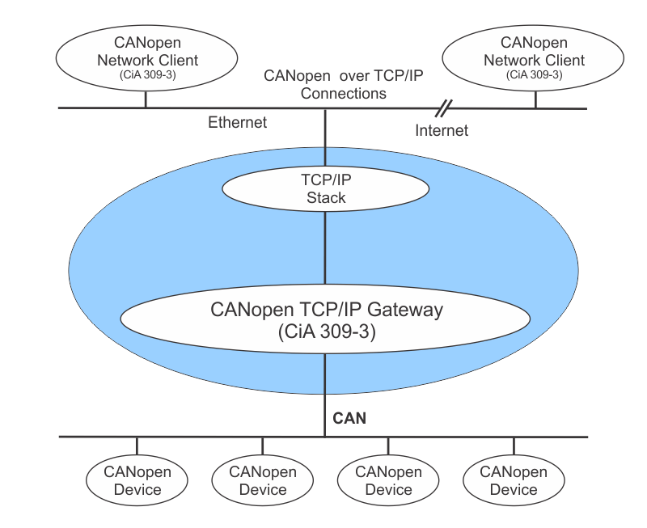

# CANopen Gateway with network client

This repo contains of 2 applications:

- canopen gateway: an application that connects to your CANopen network and serves a command interface over TCP
- canopen gateway client: a client application that connects over TCP to the command interface hosted on your CANopen gateway server



## Requirements

- Gateway: Linux device with SocketCAN kernel support, and is able to run Docker
- Client: linux device with python3 installed

In this demo I'll be using a Raspberry Pi 2 with self-made CAN shield based upon the MCP2515 CAN controller as gateway device. Basically any linux device with SocketCAN based CAN interface and ability to run Docker is good.
As client device I'll be using my laptop.

## Gateway configuration

### Setup CAN shield for Raspberry Pi

The Raspberry Pi OS doesn't automatically pickup most of the CAN hats that are available out there. Off course the linux kernel does come with the necessary support for MCP2515 CAN controller. To enable that support you must edit the `/boot/config.txt` file and add:

```
dtoverlay=mcp2515-can0,oscillator=18000000,interrupt=25 
```

Note that you must set the oscillator argument according to the frequency of the oscillator on the board you've obtained.
Next, reboot. During boot you'll notice that the CAN interface is successfully detected:

```
$ dmesg | grep can
[    6.598443] mcp251x spi0.0 can0: MCP2515 successfully initialized.
```

Note that it also tells us the name of the CAN interface in linux.

Optionally you can also install the `can-utils` which are really usefull for CAN network debugging, monitoring and analyzing:

```
$ sudo apt-get update
$ sudo apt-get install can-utils
```

### Setup docker

First update your system:
```
$ sudo apt-get update
$ sudo apt-get upgrade
```

Next install Docker using the official install script:

```
$ curl -fsSL https://get.docker.com -o get-docker.sh
$ sudo sh get-docker.sh
```

Next you may also want to ensure that your regular `pi` user can start and stop docker container:

```
$ sudo usermod -aG docker pi
```

Note that you must logout and login again for changes to take effect. After that you should be able to execute `docker version` and `docker info`, and even run the docker Hello World example: `docker run hello-world`

For more info visit: [phoenixnap.com](https://phoenixnap.com/kb/docker-on-raspberry-pi).

### Deploy gateway software on Raspberry Pi

1. Setup CAN interface on the native host:
    ```
    $ sudo ip link set up can0 type can bitrate 250000
    ```
2. Verify that your SocketCAN interface is ready:
    ```
    $ ifconfig can0
    can0: flags=193<UP,RUNNING,NOARP>  mtu 16
        unspec 00-00-00-00-00-00-00-00-00-00-00-00-00-00-00-00  txqueuelen 10  (UNSPEC)
        RX packets 12  bytes 19 (19.0 B)
        RX errors 0  dropped 12  overruns 0  frame 0
        TX packets 0  bytes 0 (0.0 B)
        TX errors 0  dropped 0 overruns 0  carrier 0  collisions 0
    ```
3. Start the CANopen gateway that acts as a service that sits between your CAN network and TCP network
    ```
    $ docker run --rm --network host -d -e CAN=can0 "geoffreyvl/canopensocket:latest"
    ```

At this stage your CANopen gateway device is up and running and is ready to accept TCP connections.

## Running the CANopen network client

To connect to the gateway's command interface you can simply use the `cocomm.py` client. 
It's a python script that initiates a TCP socket to the gateway device.

### Installing the client application

If you cloned this repo (make sure you cloned it with submodules, i.e. `git clone --recurse-submodules ...`) you can find the script within the `canopennetworkclient` folder.
If not you can still easily download the script manually using `wget`:

```
$ wget https://raw.githubusercontent.com/geoffrey-vl/canopennetworkclient/main/cocomm.py
```

### Connect to the gateway's command interface

```
$ python cocomm.py -t 192.168.0.186
```

Next type in your command and press ENTER to execute it on the gateway device. Here is an example:

```
$ python3 cocomm.py -t 192.168.0.186 --verbose
Connecting to: 192.168.0.186:6000
10 preop
# [1] 10 preop
[1] OK
10 start
# [1] 10 start
[1] OK
```

For more info about using the client application look at its [README](https://github.com/geoffrey-vl/canopennetworkclient/blob/master/README.md).

Since it's relying upon TCP you should be able to establish from everywhere inside your LAN.
Note that there is no security involved. This exposes your CAN network to the rest of your LAN and leaves the door wide open for attackers to hold on to.

## CAN bus debugging and monitoring

On your gateway device you can watch the messages on the CAN bus simultaneously with running the gateway application. 
This way you can see the messages that are transmitted from your device to another, and back. 
A simple check for communication can be done as following:

```
$ candump can0
  can0  70A   [1]  7F
  can0  70A   [1]  7F
  can0  70A   [1]  7F
```

You can also get extra info that puts a timestamp on each message, plus you may also find it useful to visualize if the messages is being received or transmitted:

```
$ candump can0 -D -t A -x
```

## Building from source

Follow the instructions from the subfolder to build each docker image from source.